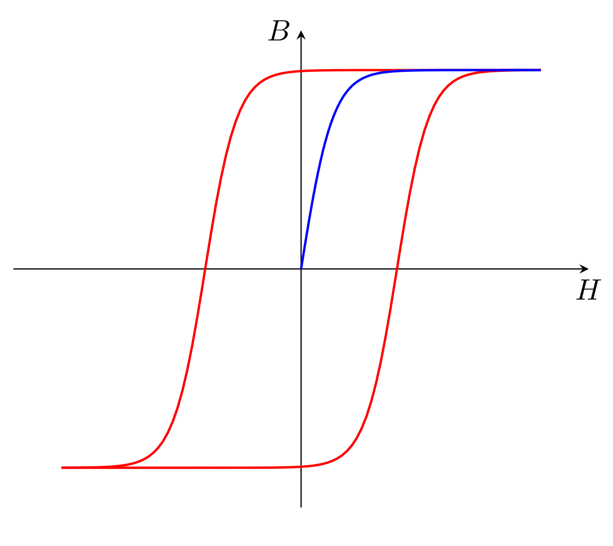

.. Hysteresis Analysis documentation master file, created by
   sphinx-quickstart on YYYY-MM-DD.
   You can adapt this file completely to your liking, but it should at least
   contain the root `toctree` directive.

========================================
Hysteresis Analysis - Documentazione
========================================

Benvenuto nella documentazione ufficiale di **Hysteresis Analysis**, un software per l'analisi dei cicli di isteresi.

**Indice della documentazione:**

.. toctree::
   :maxdepth: 2
   :caption: Contenuti

   installation
   usage
   modules
   Hysteresis
   Hysteresis.data
   Hysteresis.gui
   Hysteresis.utils

-----------------

**Cos'è Hysteresis Analysis?**
--------------------------------
`Hysteresis Analysis` è un pacchetto Python progettato per analizzare cicli di isteresi con un'interfaccia grafica intuitiva.

📌 **Caratteristiche principali**:

- 📊 **Visualizzazione dati**: Caricamento e visualizzazione dei cicli di isteresi.
- 🔧 **Strumenti di analisi**: Filtri, normalizzazione, curve fitting e altro.
- 🖥 **Interfaccia grafica user-friendly** basata su Tkinter.

-----------------

**Come iniziare?**
--------------------------------
Per installare il pacchetto, usa:

.. code-block:: bash

   pip install HysteresisAnalysis

Per avviare l'interfaccia grafica:

.. code-block:: bash

   hysteresis-analysis

Per importarlo in uno script Python:

.. code-block:: python

   from Hysteresis.gui.main_window import main
   main()

-----------------

**Navigazione**
-----------------
🔹 **[Installation](installation.html)** – Come installare il pacchetto  
🔹 **[Usage](usage.html)** – Esempi pratici di utilizzo  
🔹 **[API Reference](api_reference.html)** – Documentazione delle funzioni  
🔹 **[Contributing](contributing.html)** – Come contribuire al progetto  
🔹 **[License](license.html)** – Licenza GPL-3.0  

-----------------

**Feedback**
-----------------
Se trovi un bug o hai suggerimenti, apri un'issue su [GitHub](https://github.com/Francesco-Zeno-Costanzo/Hysteresis).

-----------------

**Indice e ricerca**
--------------------

* :ref:`genindex`
* :ref:`modindex`
* :ref:`search`

